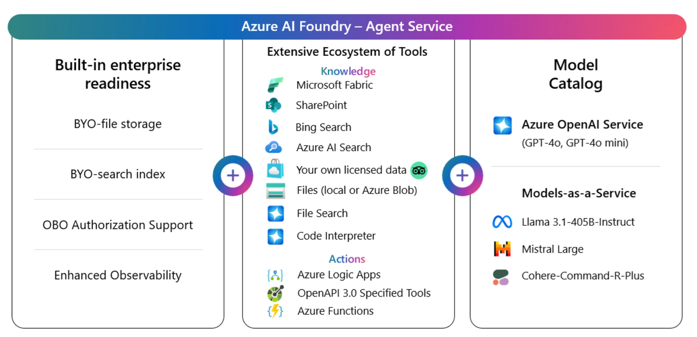

# Azure AI Agent

**Azure AI Agent Service** is a stateful, extensible platform that combines generative AI models with tools to interact with real-world data and APIs. 

Think of agents as “smart microservices” that:
- Answer complex questions using Retrieval-Augmented Generation (RAG).
- Execute actions (e.g., calling APIs, running code).
- Automate end-to-end workflows with minimal code.

Key Features:
- Automatic Tool Calling: No more parsing JSON or handling tool responses — server-side execution handles it all.
- Out-of-the-Box Tools: Bing Search, Azure AI Search, Code Interpreter, and custom functions via OpenAPI.
- Flexible Model Support: Choose from Azure OpenAI (GPT-4o), Llama 3, Mistral, or Cohere.
- Enterprise Security: Private networking, BYO storage, and regional data residency.

https://learn.microsoft.com/en-us/azure/ai-services/agents/
