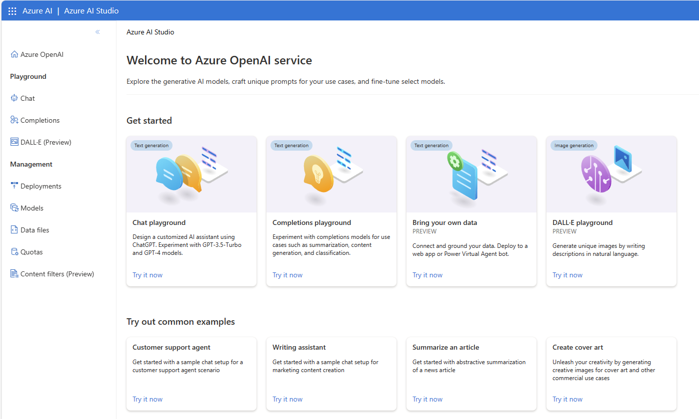

# Azure Open AI demos

If you still does not have Azure Open AI access, apply now : https://aka.ms/oai/access

## Azure Open AI Studio

 
https://oai.azure.com/portal

## New content (23-Oct-2023)

🔥 New! Automatic data visualisation with LLM:
<a href="https://github.com/retkowsky/Azure-OpenAI-demos/blob/main/LIDA/LIDA%20-%20Automatic%20Visualizations%20using%20LLM.ipynb">Go to demo</a>

🔥 New! Semantic kernel demo:
<a href="https://github.com/retkowsky/Azure-OpenAI-demos/blob/main/Semantic%20kernel/Semantic%20kernel.ipynb">Go to demo</a>

🔥 New! Fine tuning with Azure Open AI:
<a href="https://github.com/retkowsky/Azure-OpenAI-demos/blob/main/Fine%20Tuning/Fine%20Tuning%20model.ipynb">Go to demo</a>

🔥 New! Time series analysis and forecasting with Azure Open AI:
<a href="https://github.com/retkowsky/Azure-OpenAI-demos/tree/main/Time%20series">Go to demo</a>

🔥 New! Webscraping analysis documents with Azure Open AI:
<a href="https://github.com/retkowsky/Azure-OpenAI-demos/tree/main/Webscraping">Go to demo</a>

🔥 New! Airport code identification:
<a href="https://github.com/retkowsky/Azure-OpenAI-demos/blob/main/Airport%20codes%20detection/Airport%20codes%20detection.ipynb">Go to demo</a>

## New content (12-Oct-2023)

🔥 New! GPT35 Turbo Instruct model with Azure Open AI:
<a href="https://github.com/retkowsky/Azure-OpenAI-demos/blob/main/GPT35-Instruct/gpt-35-turbo-instruct.ipynb">Go to demo</a>

🔥 New! Writer assistant:
<a href="https://github.com/retkowsky/Azure-OpenAI-demos/blob/main/Writer%20assistant/Writer%20assistant.ipynb">Go to demo</a>

🔥 New! Data generation with Azure Open AI:
<a href="https://github.com/retkowsky/Azure-OpenAI-demos/blob/main/Data%20generation/Data%20generation.ipynb">Go to demo</a>

🔥 New! Text to emojis and Emojis to text:
<a href="https://github.com/retkowsky/Azure-OpenAI-demos/blob/main/Emoji%20translation/Emoji%20translation.ipynb">Go to demo</a>

🔥 New! Twitter analysis:
<a href="https://github.com/retkowsky/Azure-OpenAI-demos/blob/main/Tweeter%20analysis/Tweeter%20analysis.ipynb">Go to demo</a>

🔥 New! PII analysis:
<a href="https://github.com/retkowsky/Azure-OpenAI-demos/blob/main/PII%20analysis/PII%20analysis.ipynb">Go to demo</a>

🔥 New! Grammar analysis:
<a href="https://github.com/retkowsky/Azure-OpenAI-demos/blob/main/Grammar%20checking/Grammar.ipynb">Go to demo</a>

🔥 New! Heath report analysis:
<a href="https://github.com/retkowsky/Azure-OpenAI-demos/blob/main/Health%20report%20analysis/Health%20report%20analysis.ipynb">Go to demo</a>

🔥 New! Web article analysis:
<a href="https://github.com/retkowsky/Azure-OpenAI-demos/blob/main/Web%20article%20generation/Web%20article%20analysis.ipynb">Go to demo</a>

🔥 New! Entity analysis: 
<a href="https://github.com/retkowsky/Azure-OpenAI-demos/blob/main/Entity%20analysis/Entity%20analysis.ipynb">Go to demo</a>

🔥 New! Docstring generation for python code:
<a href="https://github.com/retkowsky/Azure-OpenAI-demos/blob/main/Python%20docstring%20generation/Python%20DocString%20generation.ipynb">Go to demo</a>

🔥 New! CSV dataset analysis:
<a href="https://github.com/retkowsky/Azure-OpenAI-demos/blob/main/CSV%20data%20analysis/CSV%20data%20analysis.ipynb">Go to demo</a>

🔥 New! GPT4 with Azure Open AI:
<a href="https://github.com/retkowsky/Azure-OpenAI-demos/blob/main/GPT4/Azure%20Open%20AI%20GPT4.ipynb">Go to demo</a>

## New content (21-Sept-2023)

<b> :fire: New! Azure Safety Content for text and images: </b>
How to use Azure Safety Content for moderation on text and images 
<a href="https://github.com/retkowsky/Azure-OpenAI-demos/tree/main/Azure%20Safety%20Content%20for%20text%20and%20images">Go to demo folder</a>

<b> :fire: New! Chunks management: </b>
Some utilities to manage chunks 
<a href="https://github.com/retkowsky/Azure-OpenAI-demos/tree/main/Chunks">Go to demo folder</a>

<b> :fire: New! Image to image using Bing Services, Azure Computer Vision and Dalle 2 from Azure Open AI: </b>
How to use Bing services to search images from a prompt, to generate a new image using Dalle 2 from Azure Open AI from a prompt generated by Azure Computer Vision 
<a href="https://github.com/retkowsky/Azure-OpenAI-demos/tree/main/Image%20to%20Image">Go to demo folder</a>

<b> :fire: New! Insurance accident report analysis: </b>
An example of an insurance accident report analysis 
<a href="https://github.com/retkowsky/Azure-OpenAI-demos/tree/main/Insurance%20report%20analysis">Go to demo folder</a>

<b> :fire: New! PDF images extraction and analysis: </b>
How to extract images from a PDF file and to get insights using Azure Computer Vision. These insights can be integrated then into Azure Cognitive Search 
<a href="https://github.com/retkowsky/Azure-OpenAI-demos/tree/main/PDF%20images%20extraction%20and%20analysis">Go to demo folder</a>

<b> :fire: New! PNR analysis: </b>
An example of a PNR analysis with Azure Open AI 
<a href="https://github.com/retkowsky/Azure-OpenAI-demos/tree/main/PNR%20analysis">Go to demo folder</a>

<b> :fire: New! Project management: </b>
An example of a project management use-case. 
<a href="https://github.com/retkowsky/Azure-OpenAI-demos/tree/main/Project%20management">Go to demo folder</a>

<b> :fire: New! SAS language analysis: </b>
How to analyse SAS language to generate insights and to convert it into others languages. 
<a href="https://github.com/retkowsky/Azure-OpenAI-demos/tree/main/SAS%20analysis">Go to demo folder</a>

<b> :fire: New! Azure Open AI Whisper for Speech to Text and analysis: </b>
Use of Azure Open AI Whisper new integration for speech to text and analysis with Azure Open AI. 
<a href="https://github.com/retkowsky/Azure-OpenAI-demos/tree/main/Speech%20to%20text%20with%20Whisper">Go to demo folder</a>

<b> :fire: New! Document translation with Azure Open AI: </b>
Document translation using Azure Open AI 
<a href="https://github.com/retkowsky/Azure-OpenAI-demos/tree/main/Translation">Go to demo folder</a>

<b> :fire: New! YouTube video analysis with Azure Open AI: </b>
YouTube video processing to generate insights using Azure Open AI 
<a href="https://github.com/retkowsky/Azure-OpenAI-demos/tree/main/YouTube%20video%20analysis">Go to demo folder</a>

## Azure Open AI demos

<b>- Azure Open AI basics: </b>
Some basic Azure Open AI demos to understand and discover Azure Open AI 
<a href="https://github.com/retkowsky/Azure-OpenAI-demos/tree/main/Basics">Go to demo folder</a>

<b>- Azure Open AI quick demos: </b>
Some demos for a quick Azure Open AI workshop 
<a href="https://github.com/retkowsky/Azure-OpenAI-demos/tree/main/Azure%20Open%20AI%20quick%20demos">Go to demo folder</a>

<b>- Vectors embeddings for text, images and audio files: </b>
Presentation of vectors embeddings for text, images and audio files. A quick demo to understand the embedding process. 
<a href = "https://github.com/retkowsky/Azure-OpenAI-demos/tree/main/Embeddings">Go to demo folder</a>

<b>- Embeddings with Pandas: </b>
Demo about embeddings using some pandas dataframe 
<a href="https://github.com/retkowsky/Azure-OpenAI-demos/tree/main/Embeddings with Pandas">Go to demo folder</a>

<b>- Azure Computer Vision and Langchain: </b>
Use of Azure Computer Vision and Langchain 
<a href="https://github.com/retkowsky/Azure-OpenAI-demos/tree/main/Azure Computer Vision and Langchain">Go to demo folder</a>

<b>- Azure Cognitive Search Vector Search JSON document analysis with Azure OpenAI: </b>
A demo about JSON document analysis with Azure Open AI and Azure Cognitive Search and its vector store 
<a href="https://github.com/retkowsky/Azure-OpenAI-demos/tree/main/Azure%20Cognitive%20Search%20Vector%20Search%20Code%20Sample%20with%20Azure%20OpenAI">Go to demo folder</a>

<b>- Python code analysis with Langchain, Azure Open AI and Azure Cognitive Search: </b>
A demo about Python notebooks analysis with Azure Open AI and Azure Cognitive Search and its vector store 
<a href = "https://github.com/retkowsky/Azure-OpenAI-demos/tree/main/Code%20analysis%20with%20Langchain%20%2B%20Azure%20OpenAI%20%2B%20Azure%20Cognitive%20Search%20(vector%20store)">Go to demo folder</a>

<b>- PDF documents analysis with Langchain, Azure Open AI and Azure Cognitive Search: </b>
A demo about analysing PDF documents with Langchain, Azure Open AI and Azure Cognitive Search and its vector store 
<a href = "https://github.com/retkowsky/Azure-OpenAI-demos/tree/main/Lanchain%20with%20Azure%20Open%20AI%20(PDF%20files)%20and%20Azure%20Cognitive%20Search">Go to demo folder</a>

<b>- Llama: </b>
Simple introduciton to LLAMA 
<a href="https://github.com/retkowsky/Azure-OpenAI-demos/tree/main/Llama">Go to demo folder</a>

<b>- Dall-e 2 images generation: </b>
How to generae artificial images with Azure Open AI and Dall e 2 
<a href="https://github.com/retkowsky/Azure-OpenAI-demos/tree/main/Artificial%20images%20with%20Dall-e%202">Go to demo folder</a>

<b>- Python function integration: </b>
How to integrate python functions with Azure Open AI 
<a href="https://github.com/retkowsky/Azure-OpenAI-demos/tree/main/Python%20functions%20integration">Go to demo folder</a>

<b>- Video Indexer transcripts analysis with Azure Open AI and Azure Cognitive Search: </b>
How to analyse Azure Video Indexer transcripts with Azure Open AI 
<a href="https://github.com/retkowsky/Azure-OpenAI-demos/tree/main/Video%20Indexer%20analysis">Go to demo folder</a>

<b>- Email response generation: </b>
How to generate automatic email response with Azure Open AI 
<a href="https://github.com/retkowsky/Azure-OpenAI-demos/tree/main/Email%20response%20generation">Got to demo folder</a>

<b>- Wikification: </b>
How to do wikification with Azure Open AI 
<a href="https://github.com/retkowsky/Azure-OpenAI-demos/tree/main/Wikification">Got to demo folder</a>

<b>- Resume analysis: </b>
How to do resume analysis with Azure Open AI 
<a href="https://github.com/retkowsky/Azure-OpenAI-demos/tree/main/Resume%20analysis">Got to demo folder</a>

<b>- Text Analytics with Azure Open AI: </b>
How to do sentiment analysis or text analytics with Azure Open AI 
<a href="https://github.com/retkowsky/Azure-OpenAI-demos/tree/main/Text%20analytics%20with%20Azure%20Open%20AI">Go to demo folder</a>

<b>- How to call a deployed Prompt Flow model? </b>
Python code to call a prompt flow deployed model. 
<a href="https://github.com/retkowsky/Azure-OpenAI-demos/tree/main/PromptFlow%20model%20deployment">Go to demo folder</a>

<b>- From text to emojis: </b>
How to categorize a text with some emojis with Azure Open AI 
<a href="https://github.com/retkowsky/Azure-OpenAI-demos/tree/main/From%20text%20to%20emoji">Go to demo folder</a>

<b>- Code optimization and conversion: </b>
How to optimize and convert some code with Azure Open AI 
<a href="https://github.com/retkowsky/Azure-OpenAI-demos/tree/main/Code%20Optimization%20and%20conversion">Go to demo folder</a>

<b>- PowerPoint generation: </b>
How to generate PowerPoint presentation with Azure Open AI 
<a href="https://github.com/retkowsky/Azure-OpenAI-demos/tree/main/PowerPoint%20generation%20with%20Azure%20Open%20AI">Go to demo folder</a>

<b>- FHIR analysis: </b>
How to analyse FHIR data (Fast Healthcare Interoperability Resources) with Azure Open AI 
<a href="https://github.com/retkowsky/Azure-OpenAI-demos/tree/main/FHIR%20analysis">Go to demo folder</a>

<b>- Utilities: </b>
Some Azure Open AI utilities 
<a href="https://github.com/retkowsky/Azure-OpenAI-demos/tree/main/Utilities">Go to demo folder</a>

<b>- Analyse audio meeting notes with Azure OpenAI and Azure Speech Services: </b>
How to analyse an audio recording meeting notes with Azure Open AI and Azure Speech services for Speech to Text and Text to Speech 
<a href="https://github.com/retkowsky/Azure-OpenAI-demos/tree/main/Analyse%20audio%20meeting%20notes%20with%20Azure%20Open%20AI%20and%20Azure%20Speech%20Services">Go to demo folder</a>

## Usecases
- Movies recommendation system using Azure Open AI and Azure Cognitive Search: 

 
<a href = "https://github.com/retkowsky/Azure-OpenAI-demos/tree/main/Movies%20recommender%20usecase%20demo">Go to demo folder</a>
 
 

Some screenshots from the movies recommendation app using Azure Open AI:

 

Some screenshots from the movies recommendation app using Azure Open AI and Azure Cognitive Search:

  

## Azure Open AI links
Azure Open AI: 
https://azure.microsoft.com/en-us/products/ai-services/openai-service-b

Documentation: 
https://learn.microsoft.com/en-us/azure/ai-services/openai/

Azure Open AI Studio: 
https://oai.azure.com/portal

What's new in Azure Open AI? 
https://learn.microsoft.com/en-us/azure/ai-services/openai/whats-new

## Azure Open AI accelerators

Azure OpenAI Workshops 
https://github.com/Azure/azure-openai-workshop
https://github.com/microsoft/OpenAIWorkshop
https://github.com/csiebler/openai-in-a-day

Azure Search Open AI solution accelerator 
https://github.com/Azure-Samples/azure-search-openai-solution-accelerator

Azure Cognitive Search Azure OpenAI Accelerator 
https://github.com/MSUSAzureAccelerators/Azure-Cognitive-Search-Azure-OpenAI-Accelerator

Azure Cognitive Search async Azure OpenAI 
https://github.com/ruoccofabrizio/azure-cognitive-search-async-azure-open-ai 
https://github.com/MSUSAzureAccelerators/Azure-Cognitive-Search-Azure-OpenAI-Accelerator/tree/main

## Responsible AI

Overview of Responsible AI practices for Azure OpenAI models 
https://learn.microsoft.com/en-us/legal/cognitive-services/openai/overview

Data, privacy, security 
https://learn.microsoft.com/en-us/legal/cognitive-services/openai/data-privacy

Content filtering 
https://learn.microsoft.com/en-us/azure/ai-services/openai/concepts/content-filter

## Some additional Azure Open AI ressources
Learn Azure Open AI 
https://learn.microsoft.com/en-us/training/modules/explore-azure-openai/

Azure OpenAI Service models 
https://learn.microsoft.com/en-GB/azure/cognitive-services/openai/concepts/models

Azure OpenAI Service Frequently Asked Questions 
https://learn.microsoft.com/en-gb/azure/cognitive-services/openai/faq

Transparency Note for Azure OpenAI Service 
https://learn.microsoft.com/en-us/legal/cognitive-services/openai/transparency-note?context=%2Fazure%2Fcognitive-services%2Fopenai%2Fcontext%2Fcontext&tabs=text

OpenAI Cookbook 
https://github.com/openai/openai-cookbook

ChatGPT + Enterprise data with Azure OpenAI and Cognitive Search 
https://github.com/Azure-Samples/azure-search-openai-demo/

Azure OpenAI samples 
https://github.com/Azure/openai-samples

Azure OpenAI Embeddings QnA 
https://github.com/ruoccofabrizio/azure-open-ai-embeddings-qna

Learn how to customize a model for your application 
https://learn.microsoft.com/en-GB/azure/cognitive-services/openai/how-to/fine-tuning?pivots=programming-language-python

Llm based virtual assistant demo 
https://github.com/csiebler/llm-based-virtual-assistant-demo

Customer Service Conversational Insights with Azure OpenAI 
https://github.com/microsoft/Customer-Service-Conversational-Insights-with-Azure-OpenAI-Services

Azure OpenAI Embeddings QnA 
https://github.com/fvneerden/azure-open-ai-embeddings-qna

Azure OpenAI Embeddings QnA from Azure Video Indexer transcripts 
https://github.com/fvneerden/azure-open-ai-embeddings-qna/tree/videosolacc

## Azure OpenAI Landing Zone reference architecture
https://techcommunity.microsoft.com/t5/azure-architecture-blog/azure-openai-landing-zone-reference-architecture/ba-p/3882102

## Azure Open AI demos videos
Microsoft AI Show demos videos: 
https://learn.microsoft.com/en-us/shows/ai-show/?expanded=azure&products=azure-openai

YouTube demos videos: 
https://www.youtube.com/results?search_query=azure+open+ai

## Azure Open AI pricing
https://azure.microsoft.com/en-us/pricing/details/cognitive-services/openai-service/

## Azure Open AI
If you still does not have Azure Open AI access, apply now : https://aka.ms/oai/access

## Author
05-Sept-2023 
Updated 23-Oct-2023 
 
Serge Retkowsky | serge.retkowsky@microsoft.com | https://www.linkedin.com/in/serger/
