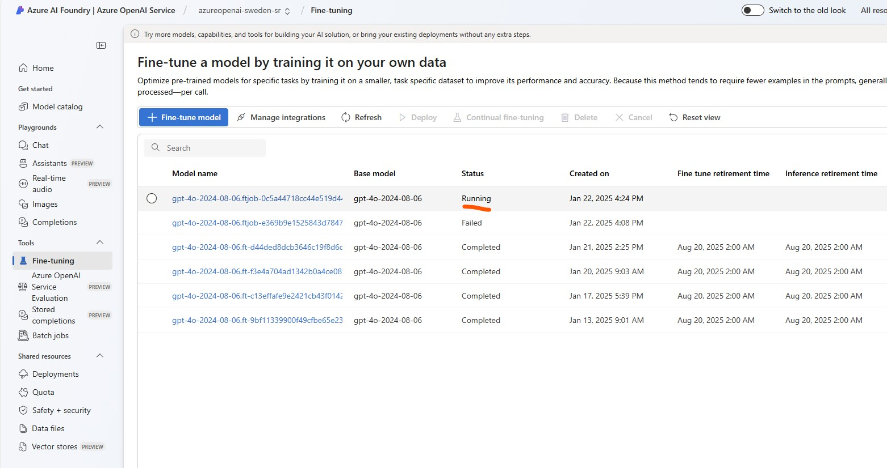
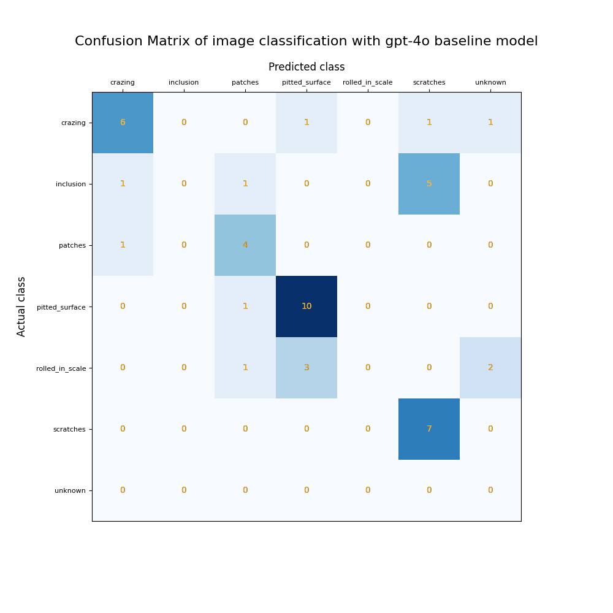
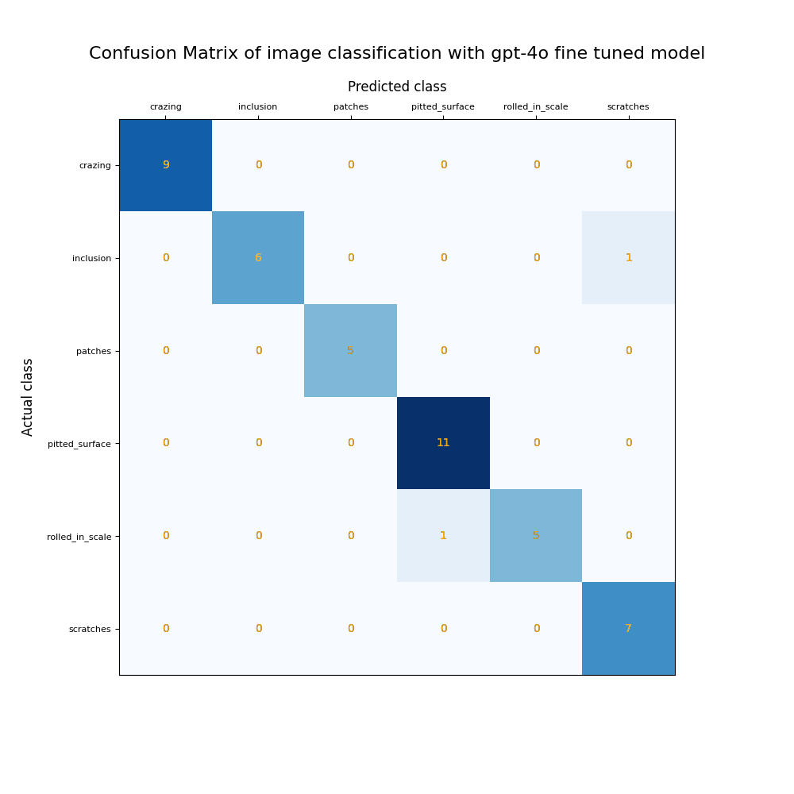
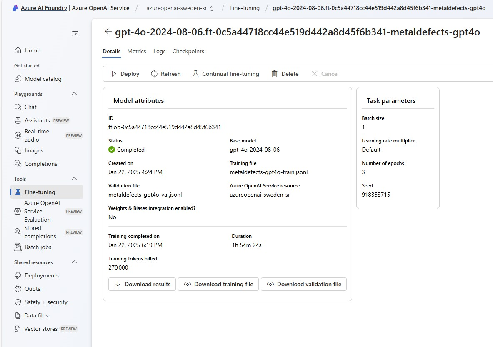
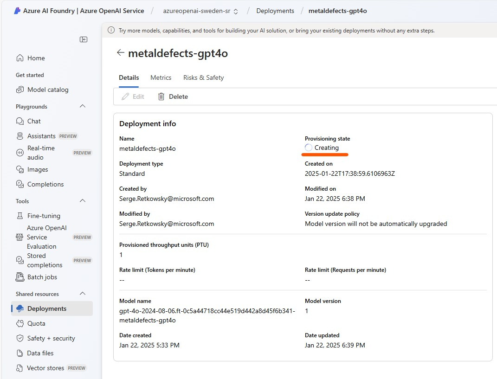
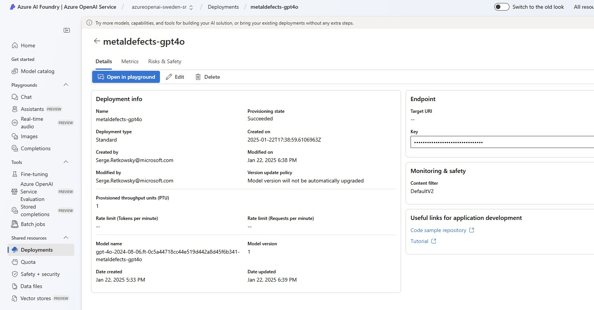
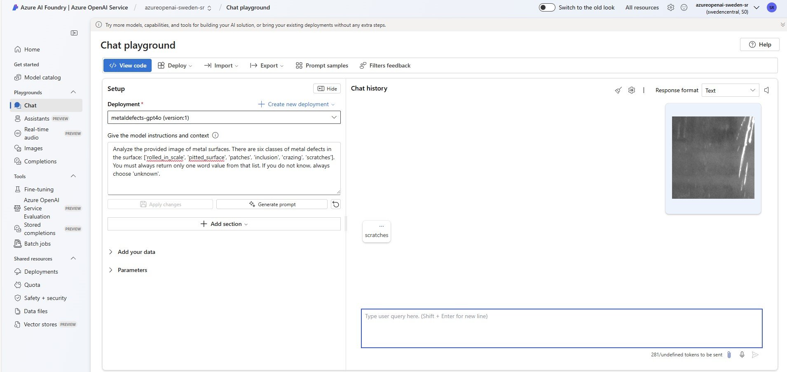

# gpt-4o model fine tuning with Azure AI Foundry for image classification

We are using some images from the <a href="https://www.kaggle.com/datasets/kaustubhdikshit/neu-surface-defect-database">NEU dataset</a> to predict the class of metal defect.
These defects are categorized into six classes: cracks (cr), inclusions (in), patches (pa), pitted surfaces (ps), rolled-in scale (rs), and scratches (sc).

- Step 1 <a href="https://github.com/retkowsky/Azure-OpenAI-demos/blob/main/gpt-4o-image-classification-finetuning/1%20Analyzing%20images%20with%20Azure%20Content%20Safety.ipynb">Go to Notebook 1</a> We are using Azure Content Safety to detect any issues with the images
- Step 2 <a href="https://github.com/retkowsky/Azure-OpenAI-demos/blob/main/gpt-4o-image-classification-finetuning/2%20Image%20classification%20with%20AOAI%20gpt-4o%20-%20Defects%20example.ipynb"> Go to notebook 2 </a> We are going to use the gpt-4o baseline model to predict its class. Accuracy is around 60%
- Step 3 <a href="https://github.com/retkowsky/Azure-OpenAI-demos/blob/main/gpt-4o-image-classification-finetuning/3%20Image%20classification%20with%20AOAI%20gpt-4o%20fine%20tuned%20model%20-%20Defects%20example.ipynb"> Go to notebook 3 </a> We are going to fine tune a gpt-4o model with Azure AI Foundry. Accuracy now is around 95%

### 1 Model training using Azure AI Foundry

### 2 Confusion matrix of the gpt-4o baseline model for image classification

### 3 Confusion matrix of the fine-tuned gpt-4o model for image classification

### 4 Model is trained with success

### 5 Deploying the model

### 6 Model is now deployed and available in Azure AI Foundry

### 7 We can use the gpt-4o fine tuned deployed model

